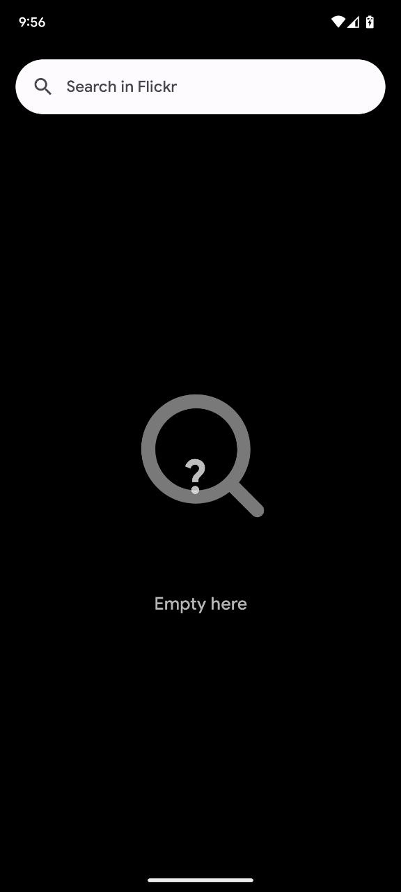
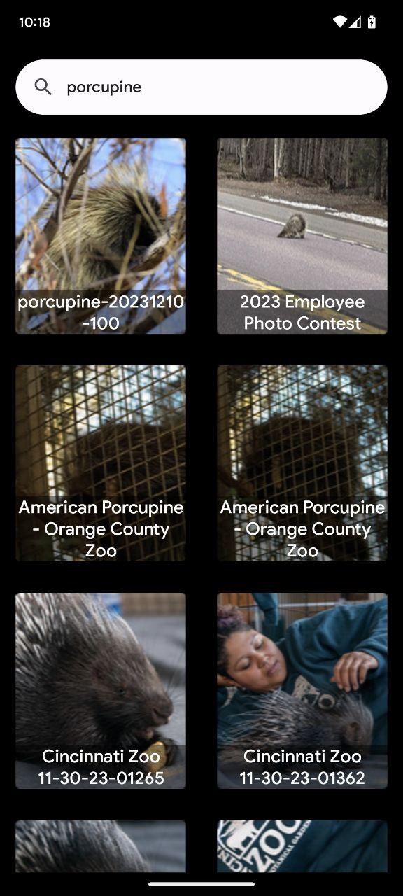
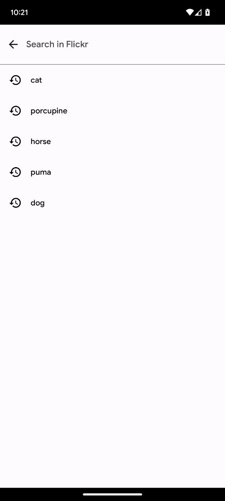
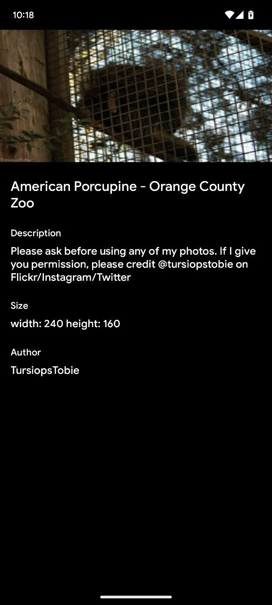
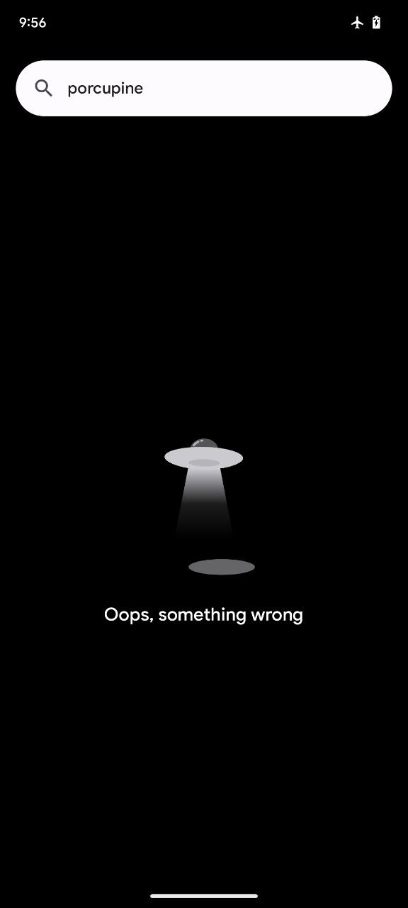
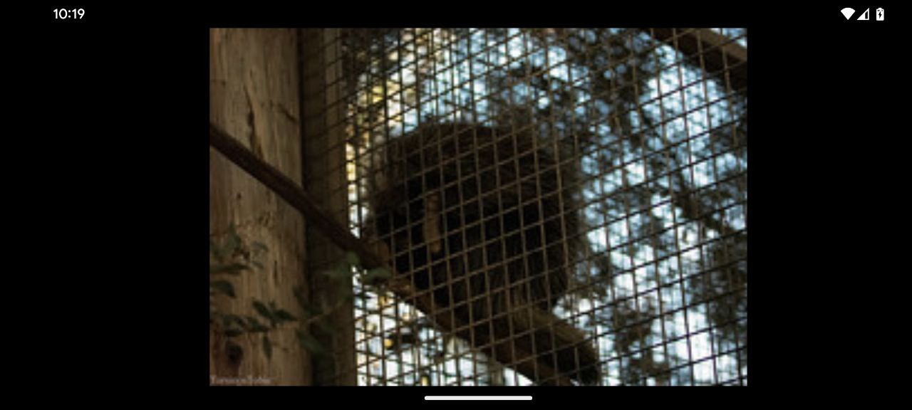

# Flickr App

Flickr App is an application created as a challenge to showcase skills in Android development.

 

### :search-app is the module responsible for displaying images information.

 

## About the project ##
 

The project has been divided into some layers to demonstrate how this division would work in a real project, using `MVVM` and `clean architecture`.

`Koin` was used for dependency injection just as an example, but it could be replaced with any other dependency injection framework like `Dagger`, `Hilt`, or even manual dependency injection, especially since the project is small.

`Koin` was configured to work independently within the `:search-app` visualization module, without any dependencies on the main `app` project. This approach is very useful when you have multiple modules with different types of dependency injection.

`SavedStateHandle` was used to store the necessary data to keep the search running. This approach is useful in cases where the operating system kills the application process in the background. This way, when you return to the activity, the search can continue from where it left off.

We can simulate this scenario by enabling `Don't Keep Activities` in the `Developer Options`.

`Version Catalogs` were used to configure the project's dependencies, but you could also use the `buildSrc` strategy for managing dependencies.

A `landscape` view was implemented in the detail activity to adhere to the requirement that "The image should span the entire screen horizontally." However, I am unsure if this was also intended to be applied to the description rule.

`Robolectric`, along with `Mockk` and `Truth`, was used for testing purposes.

Some tests were created merely to demonstrate how they would be in a real project, following the `Robot Pattern` AAA (arrange, action, assert) approach.

The `InjectionKoinTest` is a crucial test when using `Koin`. It helps us verify whether the dependency tree has been configured correctly.

## Screens

 

### Example of screens

 

 
 

 

### Example landscape view

 

